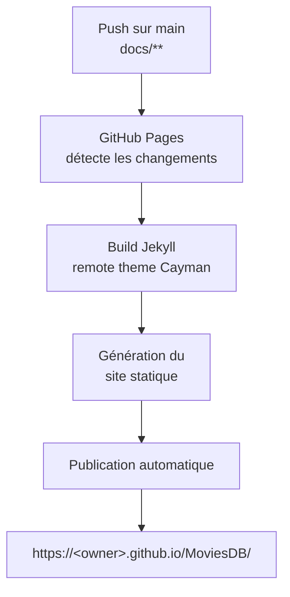

# GitHub Actions Workflows

## CI — Lint & Tests

Ce workflow vérifie automatiquement la qualité du code et l'intégrité des tests à chaque modification de fichiers Python.

### Déclenchement

Le workflow se déclenche :
- ✅ À chaque push sur les branches `main`, `features`, `features/*`, `fix/*` (si des fichiers `.py` ou `requirements*.txt` sont modifiés)
- ✅ À chaque pull request vers `main`
- ✅ Manuellement via l'onglet "Actions" → "Run workflow"

### Fonctionnement

1. **Checkout du code** : Récupère le code source
2. **Configuration Python** : Installe Python 3.13 avec cache pip
3. **Installation des dépendances** : Pipeline, Streamlit App, outils de lint et pytest
4. **Vérification PEP8** : Execute `tests/check_pep8.py` via `pycodestyle`
5. **Erreurs logiques** : Analyse `flake8` ciblant les erreurs critiques (`E9`, `F63`, `F7`, `F82`)
6. **Tests unitaires** : Lance `pytest` avec couverture de code (`--cov`)
7. **Rapport de couverture** : Upload de `coverage.xml` comme artefact (conservé 7 jours)

### Configuration

Les règles de lint sont configurées dans :
- `.pycodestyle` : Configuration principale PEP8
- `.flake8` : Configuration avancée (linting logique)

### Résolution des erreurs

Si le workflow échoue :

```bash
# Vérifier localement
python tests/check_pep8.py

# Auto-corriger les erreurs
autopep8 --in-place --aggressive --aggressive <fichier>

# Ou corriger tout le projet
autopep8 --in-place --aggressive --aggressive --recursive .
```

---

## CD — Keep-Alive Streamlit App

Ce workflow envoie automatiquement une requête HTTP à l'application Streamlit pour éviter qu'elle ne soit mise en veille par Streamlit Community Cloud.

### Contexte

Streamlit Community Cloud met les applications en veille après **7 jours** d'inactivité. Un ping quotidien suffit à maintenir l'app active sans surconsommer les minutes GitHub Actions.

### Déclenchement

Le workflow se déclenche :
- ⏰ Automatiquement **chaque jour à 9h00 UTC** (cron `0 9 * * *`)
- ✅ Manuellement via l'onglet "Actions" → "Run workflow"

### Fonctionnement

1. **Requête HTTP** : Un `curl` est envoyé vers `https://amazing-mcu-graph.streamlit.app/`
2. **Vérification** : La commande échoue si le code HTTP retourné n'est pas 2xx/3xx

### Résolution des erreurs

Si le workflow échoue, l'application Streamlit peut être temporairement indisponible. Vérifier :
- L'état de [Streamlit Community Cloud](https://share.streamlit.io/)
- Les logs de l'application dans le tableau de bord Streamlit

---

## Déploiement de la documentation

La documentation est hébergée sur **GitHub Pages** et générée automatiquement via **Jekyll** à partir du dossier `docs/`.

### Stack technique

| Composant | Détail |
|-----------|--------|
| Générateur | Jekyll (intégré à GitHub Pages) |
| Thème | `pages-themes/cayman@v0.2.0` (remote theme) |
| Plugin | `jekyll-remote-theme` |
| Source | Dossier `docs/` sur la branche `main` |

### Pipeline de déploiement



### Configuration

La navigation et les métadonnées du site sont définies dans `docs/_config.yml` :

```yaml
title: MoviesDB
description: Documentation du projet Marvel Cinematic Universe Graph
remote_theme: pages-themes/cayman@v0.2.0
plugins:
  - jekyll-remote-theme

header_pages:
  - index.md
  - documentation.md
  - neo4j-scripts-guide.md
  - Utilisation-script-run_pipeline.md
  - imdb-schema.md
  - workflow.md
```

### Ajouter une nouvelle page

1. Créer le fichier `.md` dans le dossier `docs/`
2. Ajouter l'entrée correspondante dans `header_pages` de `docs/_config.yml`
3. Référencer la page dans le tableau de `docs/index.md`
4. Pousser sur `main` — GitHub Pages recompile automatiquement

### Activation GitHub Pages

Pour activer GitHub Pages sur un nouveau fork :
1. Aller dans **Settings** → **Pages**
2. Sélectionner **Source** : `Deploy from a branch`
3. Choisir la branche `main` et le dossier `/docs`
4. Sauvegarder — le site est disponible après quelques minutes